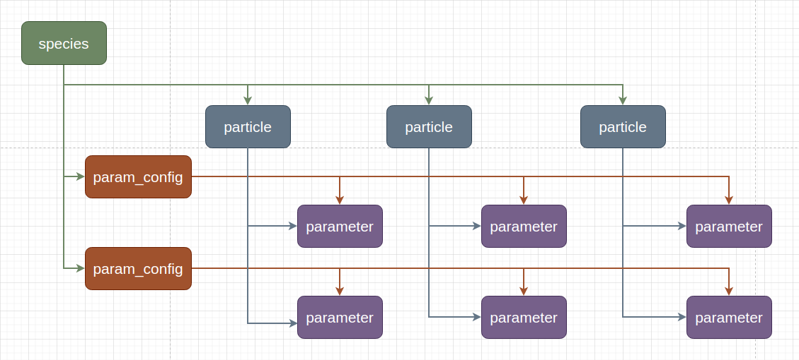

Operation control
==================

In this section, we will further control the behavior of particle operations.
In PyTorch, parameters that do not participate in gradient updates can be set as ``requires_grad=False``.
Similarly, in NyTorch, for parameters that do not participate in particle operations, we can modify the values of ParamConfig.

For convenience, we refer to parameters that do not participate in particle operations as  **non-operational Parameter** .

In this chapter, we will discuss:

	1. How to set non-operational parameters?
	2. How to control the behavior of non-operational parameters?

ParamConfig
------------

.. note::

	If two particles are derived from the same particle through particle operations,
	or if one particle is derived from another particle through particle operations,
	we say that the two particles belong to the same **species**.

Particles in the same species have the same structure and shape. When a species is created, it records the structure and shape of all parameters in the particle and assigns a ParamConfig instance to each parameter to record the settings of particle operation behavior. This means that if we want to change the behavior of a specific parameter's particle operation, we only need to modify the corresponding ParamConfig instance.

Parameters in the same species share one ParamConfig instance at the corresponding position, which means that modifying the ParamConfig instance once will modify the behavior of all particles in the species.

Below is the source code for ParamConfig, located in ``nytorch.mtype``::

    @dataclasses.dataclass
    class ParamConfig:
        operational: bool = True  # do particle operation
        clone: bool = True  # if do not particle operation then clone param
        
        ...

``operational``: When set to True, indicates that the parameter participates in particle operations; when set to False, indicates that the parameter does not participate in particle operations.

``clone``: Only meaningful for non-operational parameters. When set to True, indicates that the corresponding parameter on the new particle is a clone of the original parameter; when set to False, indicates that the corresponding parameter on the new particle is a reference to the original parameter.

We can modify the values of ParamConfig instances through the ``set_param_config()`` method. Below are some examples.

set_param_config
-----------------

In this section, we will discuss how to use the ``set_param_config()`` method to modify parameter configurations.

Here's an example model::
	
    import nytorch as nyto
    import torch

    class Linear(nyto.NytoModule):
        def __init__(self, w: float, b: float) -> None:
            super().__init__()
            self.weight = torch.nn.Parameter(torch.Tensor([w]))
            self.bias = torch.nn.Parameter(torch.Tensor([b]))

        def forward(self, x: torch.Tensor) -> torch.Tensor:
            return self.weight * x + self.bias

    class DNN(nyto.NytoModule):
        def __init__(self, w0: float, b0: float, w1: float, b1: float) -> None:
            super().__init__()
            self.layer0 = Linear(w0, b0)
            self.layer1 = Linear(w1, b1)

        def forward(self, x: torch.Tensor) -> torch.Tensor:
            return self.layer1(self.layer0(x))
            
    net = DNN(1., 2., 3., 4.)

Suppose we want to modify all parameters in ``layer0`` to be non-operational parameters, we can use the ``set_param_config()`` method. Here's the function signature::

    def set_param_config(self,
                         operational: Optional[bool]=None, 
                         clone: Optional[bool]=None,
                         name: Optional[str]=None) -> None:

We can modify the ParamConfig instance by setting operational and clone. If name is not specified, it means modifying all parameters in the current model. If name is specified, it specifies the member model or parameter to modify.

Below is an example of modifying all parameters in ``layer0`` to be non-operational parameters::

	net.layer0.set_param_config(operational=False)
	
or::

	net.set_param_config(operational=False, name="layer0")

Here's the test::

	new_net = 2 * net

::

	>>> list(net.named_parameters())
	[('layer0.weight',
	 Parameter containing:
	 tensor([1.], requires_grad=True)),
	('layer0.bias',
	 Parameter containing:
	 tensor([2.], requires_grad=True)),
	('layer1.weight',
	 Parameter containing:
	 tensor([3.], requires_grad=True)),
	('layer1.bias',
	 Parameter containing:
	 tensor([4.], requires_grad=True))]

	>>> list(new_net.named_parameters())
	[('layer0.weight',
	 Parameter containing:
	 tensor([1.], requires_grad=True)),
	('layer0.bias',
	 Parameter containing:
	 tensor([2.], requires_grad=True)),
	('layer1.weight',
	 Parameter containing:
	 tensor([6.], requires_grad=True)),
	('layer1.bias',
	 Parameter containing:
	 tensor([8.], requires_grad=True))]
	
We can see that only the values of ``net.layer1.weight`` and ``net.layer1.bias`` have changed.

If we want to modify all parameters in ``layer0`` to have ``clone=False``, we can do the following::

	net.layer0.set_param_config(clone=False)

or::

	net.set_param_config(clone=False, name="layer0")

.. note::

	Modifying the ``clone`` value of the ParamConfig instance is only meaningful when ``operational=False``.

Let's compare the differences between ``clone=True`` and ``clone=False``::

	net.layer0.set_param_config(clone=True)
	new_net = 2 * net

::

	>>> net.layer0.weight is new_net.layer0.weight
	False
	
	>>> net.layer0.bias is new_net.layer0.bias
	False

::

	net.layer0.set_param_config(clone=False)
	new_net = 2 * net

::

	>>> net.layer0.weight is new_net.layer0.weight
	True
	
	>>> net.layer0.bias is new_net.layer0.bias
	True

We can see that for non-operational parameters, when ``clone=True``, a clone of the original parameter is returned; when ``clone=False``, a reference to the original parameter is returned.

apply_param_config
--------------------

Sometimes, we need to manually add new attributes to instances of ParamConfig, which means we need to access instances of ParamConfig directly. In such cases, we can use the ``apply_param_config()`` method. Below is the function signature::

    def apply_param_config(self, 
                           fn: Callable[[ParamID, ParamConfig], None],
                           name: Optional[str]=None) -> None:

We can use it by passing a function that accepts two inputs: the parameter ID and the corresponding ParamConfig instance. If name is not specified, it indicates modifying all parameters in the current model. If name is specified, it specifies the member model or parameter to be modified.

Here is an example of using ``apply_param_config()`` to set all parameters in ``layer0`` to be non-operational::

    def print_config(pid: 'ParamID', config: 'ParamConfig') -> None:
        print(f"{pid=} {config=}")
    
    def set_operational_false(pid: 'ParamID', config: 'ParamConfig') -> None:
        config.operational = False

::

    >>> net.layer0.apply_param_config(set_operational_false)
    >>> net.apply_param_config(print_config)
    pid=0 config=ParamConfig(operational=False, clone=True)
    pid=1 config=ParamConfig(operational=False, clone=True)
    
Or::

    >>> net.apply_param_config(set_operational_false, name='layer0')
    >>> net.apply_param_config(print_config)
    pid=0 config=ParamConfig(operational=False, clone=True)
    pid=1 config=ParamConfig(operational=False, clone=True)

get_param_id
--------------------

Each parameter in Particle is assigned a unique identifier. If you want to query the identifier of a parameter, you can use the ``get_param_id()`` method.

Here is an example::

    class DNN(nyto.NytoModule):
        def __init__(self):
            super().__init__()
            self.layer0 = nn.Linear(6, 12)
            self.layer1 = nn.Linear(12, 2)
        
        def forward(self, x):
            return self.layer1(self.layer0(x))

    net = DNN()
    
::

    >>> layer0_weight = net.layer0.weight
    >>> net.get_param_id(layer0_weight)
    0
    
    >>> layer0_bias = net.layer0.bias
    >>> net.get_param_id(layer0_bias)
    1
    
    >>> layer1_weight = net.layer1.weight
    >>> net.get_param_id(layer1_weight)
    2

To be more precise, the identifier is the index of the parameter in Particle. Therefore, different parameters at the same position in different particles will have the same identifier.

Here is an example::

    net1 = DNN()
    net2 = net.randn()
    
    net1_layer0_weight = net1.layer0.weight
    net2_layer0_weight = net2.layer0.weight

::

    >>> net1.get_param_id(net1_layer0_weight) == net2.get_param_id(net2_layer0_weight)
    True
    
    >>> net1_layer0_bias = net1.layer0.bias
    >>> net2_layer0_bias = net2.layer0.bias
    >>> net1.get_param_id(net1_layer0_bias) == net2.get_param_id(net2_layer0_bias)
    True

Marking weight and bias
--------------------------

Here is an example regarding customizatio.

When Particle operation occurs, the operating logic reads each parameter in the model and the corresponding ParamConfig instance. So, if our operating logic needs to handle weights and biases differently, we need to mark the corresponding ParamConfig instance in advance.

Here is how you can do it::

    import nytorch as nyto
    import torch
    import torch.nn as nn

    class CNN(nyto.NytoModule):
        def __init__(self):
            super().__init__()
            self.conv1 = nn.Sequential(nn.Conv2d(in_channels = 1, 
                                                 out_channels = 16, 
                                                 kernel_size = 5, 
                                                 stride = 1, 
                                                 padding = 2),
                                       nn.ReLU(),
                                       nn.MaxPool2d(kernel_size = 2))
            self.conv2 = nn.Sequential(nn.Conv2d(16, 32, 5, 1, 2),
                                       nn.ReLU(),
                                       nn.MaxPool2d(2))
            self.output_layer = nn.Linear(32*7*7, 10)

        def forward(self, x):
            x = self.conv1(x)
            x = self.conv2(x)
            x = x.view(x.size(0), -1)
            output = self.output_layer(x)
            return output, x
    
    net = CNN()

Get the parameter IDs of weights::

    weight_set: set['ParamID'] = {
        net.get_param_id(sub_param)
        for name, sub_param in net.named_parameters()
        if name.split('.')[-1] == 'weight'}

Add a new attribute ``is_weight`` to the corresponding ParamConfig instances::

    def making_weight_and_bias(pid: 'ParamID', config: 'ParamConfig') -> None:
        if pid in weight_set:
            config.is_weight = True
        else:
            config.is_weight = False
            
    net.apply_param_config(making_weight_and_bias)

Check the modified results::

    def print_config(pid: 'ParamID', config: 'ParamConfig') -> None:
        print(f"{pid=} {config=}")

::

    >>> net.apply_param_config(print_config)
    pid=0 config=ParamConfig(operational=True, clone=True, is_weight=True)
    pid=1 config=ParamConfig(operational=True, clone=True, is_weight=False)
    pid=2 config=ParamConfig(operational=True, clone=True, is_weight=True)
    pid=3 config=ParamConfig(operational=True, clone=True, is_weight=False)
    pid=4 config=ParamConfig(operational=True, clone=True, is_weight=True)
    pid=5 config=ParamConfig(operational=True, clone=True, is_weight=False)

Above is the explanation of customizing new attributes. By customizing new attributes, we can have more freedom when customizing Particle operations. More about customizing Particle operations will be discussed in the next section.

