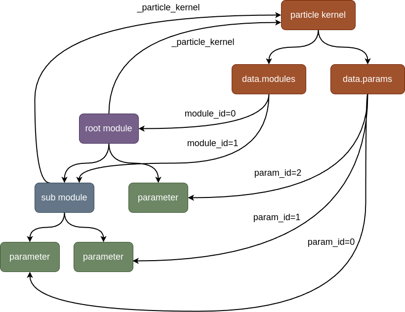
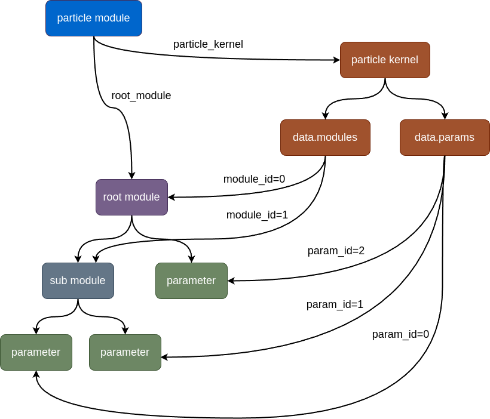

ParticleModule
==================

Using NytoModule, creating a module automatically updates its version. The underlying principle is that when the metadata of a module is modified, the module indirectly accesses the version instance through the particle kernel and records the relevant information about the modification through the version instance. This allows other particles to update to the latest version through the version instance.

However, this feature is not commonly used, and for the sake of such functionality, there is a sacrifice in performance.

From the particle structure diagram, a circular reference structure can be observed, which can cause memory pressure for programming languages like Python that use garbage collection. We can conduct a simple experiment to observe the process from initializing a particle to reclaiming it in Python::

    import nytorch as nyto
    import torch
    import torch.nn as nn
    
    CNN_COUNTER: int = 0

    class CNN(nyto.NytoModule):
        def __init__(self):
            super().__init__()
            self.init()
            ...
            
        def __del__(self):
            print(f"delete cnn={self.module_id}")
        
        def __add__(self, *args, **kwargs):
            new_cnn = super().__add__(*args, **kwargs)
            new_cnn.init()
            return new_cnn
    
        def __mul__(self, *args, **kwargs):
            new_cnn = super().__mul__(*args, **kwargs)
            new_cnn.init()
            return new_cnn
            
        def init(self):
            global CNN_COUNTER
            CNN_COUNTER += 1
            self.module_id = CNN_COUNTER
            print(f"init cnn={self.module_id}")
        ...    
    
    def particle_operation_loop10():
        net = CNN()
        for i in range(10):
            net = 0.5 * net + 10

The result of running the above code::

    >>> particle_operation_loop10()
    init cnn=1
    init cnn=2
    init cnn=3
    init cnn=4
    init cnn=5
    init cnn=6
    init cnn=7
    init cnn=8
    init cnn=9
    init cnn=10
    init cnn=11
    init cnn=12
    delete cnn=3
    delete cnn=4
    delete cnn=5
    delete cnn=6
    delete cnn=7
    delete cnn=8
    delete cnn=9
    delete cnn=10
    init cnn=13
    init cnn=14
    init cnn=15
    init cnn=16
    init cnn=17
    init cnn=18
    init cnn=19
    init cnn=20
    init cnn=21
    delete cnn=14
    delete cnn=15
    delete cnn=16
    delete cnn=17
    delete cnn=18
    delete cnn=19
    delete cnn=20
    delete cnn=21
    delete cnn=1
    delete cnn=2
    delete cnn=11
    delete cnn=12
    delete cnn=13

It can be observed that there is a longer cycle from initializing a particle to reclaiming it.

To avoid memory pressure, nytorch provides particle_module.ParticleModule to solve the problem of circular reference.

Model
--------------------

Below is the particle model structure using ParticleModule:

It can be seen that ParticleModule resolves the circular reference problem by clearing the module's reference to the particle kernel and can restore the reference to the particle kernel at any time.

Below is part of the code for ParticleModule, which shows that ParticleModule is a decorator, and its purpose is to facilitate clearing or restoring the module's reference to the particle kernel::

    class ParticleModule(nn.Module, Particle[PMProduct]):
        def __init__(self, root_module: Tmodule) -> None:
            ...
            super().__init__()
            self.particle_kernel: ParticleKernelImp = root_module._particle_kernel
            self.root_module: Tmodule = root_module
            self.clear_kernel_ref()
        
        def forward(self, *args, **kwargs):
            return self.root_module(*args, **kwargs)
            
        def clear_kernel_ref(self) -> None:
            for submodule in self.root_module.modules():
                if isinstance(submodule, NytoModuleBase):
                    submodule._particle_kernel = None
                
        def restore_kernel_ref(self) -> None:
            for submodule in self.root_module.modules():
                if isinstance(submodule, NytoModuleBase):
                    submodule._particle_kernel = self.particle_kernel
            
        ...

Using ParticleModule with a model inherited from NytoModule::

    from nytorch import NytoModule
    from nytorch.particle_module import ParticleModule
    import torch
    import torch.nn as nn
    import torch.nn.functional as F

    class MyModel(NytoModule):
        def __init__(self, in_feat: int, h_size: int, out_feat: int):
            super().__init__()
            self.layer1 = nn.Linear(in_feat, h_size)
            self.layer2 = nn.Linear(h_size, out_feat)

        def forward(self, inpts):
            h_out = F.relu(self.layer1(inpts))
            return self.layer2(h_out)

    net = MyModel(4, 12 ,3)
    net = ParticleModule(net)

Using it is similar to using a regular ``torch.nn.Module``::

    >>> net(torch.randn(2, 4))
    tensor([[ 0.3108, -0.0365,  0.1589],
            [ 0.2627,  0.2605, -0.0809]], grad_fn=<AddmmBackward0>)

    >>> list(net.parameters())
    [Parameter containing:
     tensor([[ 0.3434,  0.1136, -0.0762, -0.3682],
             [-0.4386, -0.2468,  0.0393, -0.4668],
             [ 0.2795,  0.0283,  0.0952,  0.4143],
     ...
     Parameter containing:
     tensor([0.0306, 0.0591, 0.2293], requires_grad=True)]

You can access the original model through the ``root_module`` attribute::

    >>> net.root_module
    MyModel(
      (layer1): Linear(in_features=4, out_features=12, bias=True)
      (layer2): Linear(in_features=12, out_features=3, bias=True)
    )

However, it's recommended not to perform any direct operations on the original model since the reference to the particle kernel has been cleared. If necessary, you can restore the reference to the particle kernel using the ``restore_kernel_ref()`` method and clear the reference using the ``clear_kernel_ref()`` method::

    >>> net.restore_kernel_ref()
    >>> net.root_module._particle_kernel is None
    False
    
    net.clear_kernel_ref()
    >>> net.root_module._particle_kernel is None
    True

Particle operation
--------------------

Although some operations require a reference to the particle kernel before being performed, particle operations do not require this hassle.

ParticleModule supports all particle operations of NytoModule::

    >>> net + 1
    ParticleModule(
      (root_module): MyModel(
        (layer1): Linear(in_features=4, out_features=12, bias=True)
        (layer2): Linear(in_features=12, out_features=3, bias=True)
      )
    )
    
    >>> 2 * net
    ParticleModule(
      (root_module): MyModel(
       (layer1): Linear(in_features=4, out_features=12, bias=True)
        (layer2): Linear(in_features=12, out_features=3, bias=True)
      )
    )

In NytoModule, this direct particle operation is not very efficient for computations involving a large number of intermediate variables. 
Therefore, we first call ``product()`` to transform NytoModule into ParamProduct before performing operations. 
When NytoModule is needed again, it is transformed back. This helps to reduce unnecessary transformations.

Similarly, in ParticleModule, we perform a similar operation where we also use ``product()`` for the transformation. 
However, the resulting object is not ParamProduct but PMProduct::

    >>> net.product()
    <nytorch.particle_module.PMProduct at 0x7f9aec1b8730>
    
PMProduct serves as a decorator for ParamProduct, facilitating the transformation of the object converted by ParamProduct from NytoModule to ParticleModule::

    from nytorch.module import ParamProduct

    product1 = net.product()

::

    >>> isinstance(product1.product, ParamProduct)
    True

    >>> isinstance(product1.module(), ParticleModule)
    True

And PMProduct supports all particle operations of ParamProduct::

    product2 = product1 + 1
    
    product3 = 2 * product2
	
    product4 = product3.unary_operator(lambda param, config: 2*param + 10)

    product5 = product4.binary_operator(product3, 
                                        lambda param1, param2, config: param1+param2)

    product6 = product5.randn()

Additionally, it is possible to transform from PMProduct back to ParticleModule.::

    >>> product1.module()
    ParticleModule(
      (root_module): MyModel(
        (layer1): Linear(in_features=4, out_features=12, bias=True)
        (layer2): Linear(in_features=12, out_features=3, bias=True)
      )
    )

Garbage Collection Cycles
-------------------------------

Previously, we mentioned that if ParticleModule is not used, it will result in a circular reference structure for particles, which will cause longer memory recycling periods. But how much of a difference does this make? Let's demonstrate the difference using the example provided earlier.

Here are the results without using ParticleModule::

    init cnn=1
    init cnn=2
    init cnn=3
    init cnn=4
    init cnn=5
    init cnn=6
    init cnn=7
    init cnn=8
    init cnn=9
    init cnn=10
    init cnn=11
    init cnn=12
    delete cnn=3
    delete cnn=4
    delete cnn=5
    delete cnn=6
    delete cnn=7
    delete cnn=8
    delete cnn=9
    delete cnn=10
    init cnn=13
    init cnn=14
    init cnn=15
    init cnn=16
    init cnn=17
    init cnn=18
    init cnn=19
    init cnn=20
    init cnn=21
    delete cnn=14
    delete cnn=15
    delete cnn=16
    delete cnn=17
    delete cnn=18
    delete cnn=19
    delete cnn=20
    delete cnn=21
    delete cnn=1
    delete cnn=2
    delete cnn=11
    delete cnn=12
    delete cnn=13

And here are the results using ParticleModule::

    init cnn=1
    init cnn=2
    init cnn=3
    delete cnn=2
    delete cnn=1
    init cnn=4
    init cnn=5
    delete cnn=4
    delete cnn=3
    init cnn=6
    init cnn=7
    delete cnn=6
    delete cnn=5
    init cnn=8
    init cnn=9
    delete cnn=8
    delete cnn=7
    init cnn=10
    init cnn=11
    delete cnn=10
    delete cnn=9
    init cnn=12
    init cnn=13
    delete cnn=12
    delete cnn=11
    init cnn=14
    init cnn=15
    delete cnn=14
    delete cnn=13
    init cnn=16
    init cnn=17
    delete cnn=16
    delete cnn=15
    init cnn=18
    init cnn=19
    delete cnn=18
    delete cnn=17
    init cnn=20
    init cnn=21
    delete cnn=20
    delete cnn=19
    delete cnn=21

We can see that the model using ParticleModule has shorter recycling periods, so using ParticleModule is clearly worthwhile. Below are the implementations corresponding to the two results.

Without using ParticleModule::

    import nytorch as nyto
    import torch.nn as nn
    from nytorch.particle_module import ParticleModule

    CNN_COUNTER: int = 0

    class CNN(nyto.NytoModule):
        def __init__(self):
            super().__init__()
            self.conv1 = nn.Sequential(nn.Conv2d(in_channels = 1,
                                                 out_channels = 16,
                                                 kernel_size = 5,
                                                 stride = 1,
                                                 padding = 2),
                                       nn.ReLU(),
                                       nn.MaxPool2d(kernel_size = 2))
            self.conv2 = nn.Sequential(nn.Conv2d(16, 32, 5, 1, 2),
                                       nn.ReLU(),
                                       nn.MaxPool2d(2))
            self.output_layer = nn.Linear(32*7*7, 10)

            self.init()

        def __del__(self):
            print(f"delete cnn={self.module_id}")

        def __add__(self, *args, **kwargs):
            new_cnn = super().__add__(*args, **kwargs)
            new_cnn.init()
            return new_cnn

        def __mul__(self, *args, **kwargs):
            new_cnn = super().__mul__(*args, **kwargs)
            new_cnn.init()
            return new_cnn
    
        def init(self):
            global CNN_COUNTER
            CNN_COUNTER += 1
            self.module_id = CNN_COUNTER
            print(f"init cnn={self.module_id}")

        def forward(self, x):
            x = self.conv1(x)
            x = self.conv2(x)
            x = x.view(x.size(0), -1)
            output = self.output_layer(x)
            return output, x

    def particle_operation_loop10():
        net = CNN()
        for i in range(10):
            net = 0.5 * net + 10

    particle_operation_loop10()

Using ParticleModule::

    import nytorch as nyto
    import torch.nn as nn
    from nytorch.mtype import ROOT_MODULE_ID
    from nytorch.particle_module import ParticleModule, PMProduct

    CNN_COUNTER: int = 0

    class CNN(nyto.NytoModule):
        def __init__(self):
            super().__init__()
            self.conv1 = nn.Sequential(nn.Conv2d(in_channels = 1,
                                                 out_channels = 16,
                                                 kernel_size = 5,
                                                 stride = 1,
                                                 padding = 2),
                                       nn.ReLU(),
                                       nn.MaxPool2d(kernel_size = 2))
            self.conv2 = nn.Sequential(nn.Conv2d(16, 32, 5, 1, 2),
                                       nn.ReLU(),
                                       nn.MaxPool2d(2))
            self.output_layer = nn.Linear(32*7*7, 10)

        def forward(self, x):
            x = self.conv1(x)
            x = self.conv2(x)
            x = x.view(x.size(0), -1)
            output = self.output_layer(x)
            return output, x

    class MyPMProduct(PMProduct):
        @classmethod
        def from_ParamProduct(cls, product: 'ParamProduct') -> PMProduct:
            return MyPMProduct(product.kernel, 
                               product.module_id, 
                               product.params)

        def particle(self) -> 'MyParticleModule':
            return MyParticleModule(self.product.module())

    class MyParticleModule(ParticleModule):
        def __init__(self, *args, **kwargs):
            super().__init__(*args, **kwargs)
            
            global CNN_COUNTER
            CNN_COUNTER += 1
            self.module_id = CNN_COUNTER
            print(f"init cnn={self.module_id}")

        def __del__(self):
            print(f"delete cnn={self.module_id}")   

        def product(self) -> MyPMProduct:
            return MyPMProduct(self.particle_kernel, 
                               ROOT_MODULE_ID, 
                               self.particle_kernel.data.params)

    def particle_operation_loop10():
        net = MyParticleModule(CNN())
        for i in range(10):
            net = 0.5 * net + 10

    particle_operation_loop10()

