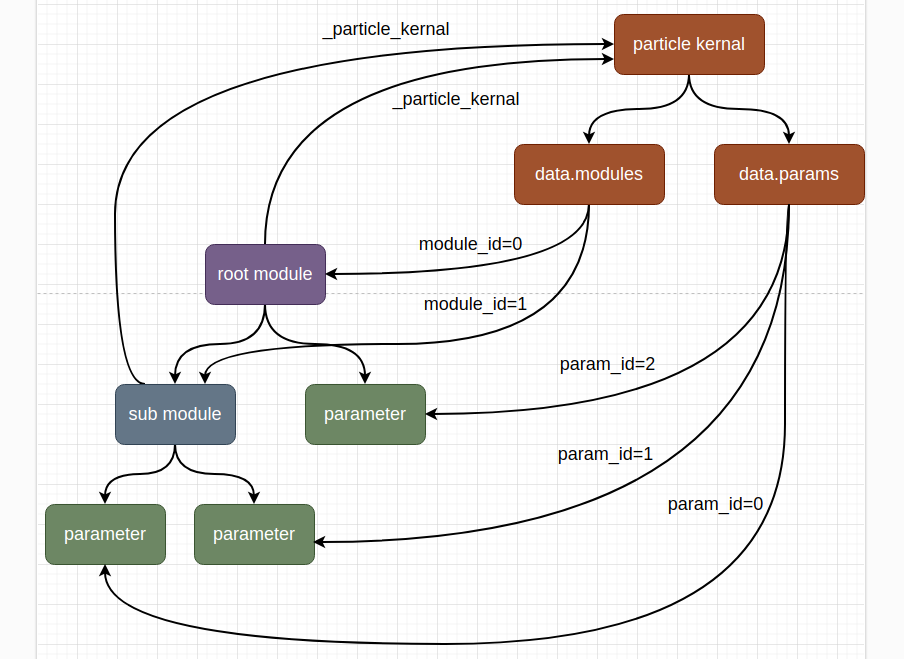

Particle
==================

In this chapter,
we will discuss the creation of particles.
Although not understanding the content of this chapter may not affect your model training,
if you encounter problems in model construction,
the content of this chapter may provide you with answers.

Particle kernal
------------------

.. note::

	We usually consider a module instance and its submodules as a particle,
	because they need to work together to complete a forward pass.
	In Nytorch, there are two definitions for the **root module**:
	
		1. A particle has only one root module.
		2. The module that can traverse all modules in the particle starting from itself.
	
	.. image:: ./image/root_module.png
		:width: 500

In the previous chapters, we mentioned that when particle operations occur, if the target is not the root module, a new particle corresponding to the module will be returned::

    class Layer(nyto.NytoModule):
        def __init__(self, in_size, out_size):
            super().__init__()
            self.lin = nn.Linear(in_size, out_size)
    
        def forward(self, x):
            return self.lin(x)
    
    
    class ResLayer(nyto.NytoModule):
        def __init__(self, in_size, out_size):
            super().__init__()
            self.sub_moudle = Layer(in_size, out_size)
    
        def forward(self, x):
            return self.sub_moudle(x) + x
    
    root_module = ResLayer(12, 2)
    sub_moudle = root_module.sub_moudle
    
    new_sub_moudle = sub_moudle + 10

This implies two things:

	1. ``root_module`` and ``sub_module`` belong to the same particle.
	2. When generating ``new_sub_module``, a new particle is also generated.
   
These two things can lead to three questions:

	1. How do we confirm that two module instances belong to the same particle?
	2. Can a module instance belong to multiple particles simultaneously?
	3. Can we obtain the root module of ``new_sub_module``?
	
To answer these questions,
we must understand the program structure of particles.

Below is an example of a particle structure diagram.

And the corresponding code::

    class RootModule(nyto.NytoModule):
        def __init__(self):
            super().__init__()
            self.sub_module = SubModule()
            self.param2 = nn.Parameter(torch.Tensor([2]))
        
        ...
        
    class SubModule(nyto.NytoModule):
        def __init__(self):
            super().__init__()
            self.param0 = nn.Parameter(torch.Tensor([0]))
            self.param1 = nn.Parameter(torch.Tensor([1]))
            
        ...

Now let's answer the previous three questions by combining the structural diagram and the code.

Each NytoModule is assigned to only one ParticleKernel instance,
and each ParticleKernel instance represents an independent particle.
Now we can answer the first question,
if two modules point to the same ParticleKernel instance,
it means that they belong to the same particle.

We can obtain the ParticleKernel instance pointed to by the module through ``_particle_kernel``,
here is an example::

    module1 = RootModule()
    module2 = module1.sub_module
    module3 = module1.randn()
    module4 = module3.sub_module

::

    >>> module1._particle_kernal is module2._particle_kernal
    True
    
    >>> module1._particle_kernal is module3._particle_kernal
    False
    
    >>> module3._particle_kernal is module4._particle_kernal
    True

This also answers our second question, that is, each module can only belong to one particle.

.. note::

	However, there is a potential misunderstanding here,
	although each module can only point to one ParticleKernel instance,
	for a ParticleKernel instance,
	it may point to modules belonging to other particles due to improper operations,
	this will be mentioned after answering the three questions.

Finally, let's answer the third question,
since we know that any module can access its ParticleKernel instance,
this question can be transformed into: how can we get the Module belonging to the particle through the ParticleKernel instance?

From the structural diagram, we can know that the ParticleKernel instance has two attributes ``data.modules`` and ``data.params`` ,
which can obtain the Module and Parameter belonging to the particle,
they are saved in the corresponding OrderedDict::

    >>> module1._particle_kernal.data.modules
    OrderedDict([(0,
                  RootModule(
                    (sub_module): SubModule()
                  )),
                 (1, SubModule())])
             
    >>> module1._particle_kernal.data.params
    OrderedDict([(0,
                  Parameter containing:
                  tensor([0.], requires_grad=True)),
                 (1,
                  Parameter containing:
                  tensor([1.], requires_grad=True)),
                 (2,
                  Parameter containing:
                  tensor([2.], requires_grad=True))])

Risky Operations
------------------

Next, let's discuss some operations for creating particles that may cause errors or have potential risks.
There are two cases:

	1. The root module is referenced by submodules.
	2. The module is referenced by multiple particles.

Let's look at the first case,
if such an operation occurs, a warning will be issued::

    class ModuleA(nyto.NytoModule):
        def __init__(self):
            super().__init__()
            self.sub_module = ModuleB()
            self.sub_module.root = self  # warnings
            
        ...

    class ModuleB(nyto.NytoModule):
        def __init__(self):
            super().__init__()
            
        ...
        
Next, let's look at the second case,
if such an operation occurs, a warning will be issued::

    class ModuleA(nyto.NytoModule):
        def __init__(self):
            super().__init__()
        ...
        
    class ModuleB(nyto.NytoModule):
        def __init__(self, sub_module):
            super().__init__()
            self.sub_module = sub_module
        
        ...
        
    class ModuleC(nyto.NytoModule):
        def __init__(self, sub_module):
            super().__init__()
            self.sub_module = sub_module  # warnings
        
        ...
        
    sub_module = ModuleA()
    root1 = ModuleB(sub_module)
    root2 = ModuleC(sub_module)

The process is as follows.

When each module is created,
each module creates a new particle,
and itself becomes the root module of the new particle.

When the module is added as a submodule,
if the submodule belongs to the same particle as itself,
it will check whether the added submodule is the root module of the particle where the module is located,
if it is, a warning will be issued,
this is the first risky operation.
If it is not, it will continue with other processes.

When the module is added as a submodule,
if the submodule belongs to another particle,
it will check whether the added submodule is the root module of the particle where the submodule is located,
if it is, it will change the particle pointed to by the submodule to its own particle.
If it is not, a warning will be issued,
this is the second risky operation we will discuss later.

Circular References to the Root Module
~~~~~~~~~~~~~~~~~~~~~~~~~~~~~~~~~~~~~~~~~~~~~~~~~~~

Let's discuss the first risky operation, where we encounter two issues:

	1. Why do we get such warnings?
	2. How can we address these warnings if encountered?
	
Why do we get such warnings?
The reason for these warnings is to facilitate the removal of unused modules. Consider the following scenario::

    class ModuleA(nyto.NytoModule):
        def __init__(self):
            super().__init__()
            self.b = ModuleB()
        
    class ModuleB(nyto.NytoModule):
        def __init__(self):
            super().__init__()
            self.c = ModuleC()
        
    class ModuleC(nyto.NytoModule):
        def __init__(self):
            super().__init__()

    root = ModuleA()
    del root.b
    
When we delete the reference to ``root.b``, we lose access to the instances of ``ModuleB`` and ``ModuleC``, making them potentially eligible for cleanup by Python's garbage collector. However, since we can still access the corresponding instances through ``root._particle_kernal``, they may not be cleared by Python's garbage collector, which is problematic.

Our approach is to identify modules that cannot be accessed from the root module after a reference deletion and then remove them.

Therefore, the root module must be a module that can access all modules. But is the root module the only module that can achieve this? Clearly, if a module can directly access the root module, both modules can fulfill this criterion.

However, this presents a problem: if a particle contains two modules that both qualify as the root module, which one is the true root module?

Consider the following example::

    class ModuleA(nyto.NytoModule):
        def __init__(self):
            super().__init__()
            self.b = ModuleB(self)
        ...
        
    class ModuleB(nyto.NytoModule):
        def __init__(self, a):
            super().__init__()
            self.a = a
        ...
        
    module_a = ModuleA()
    module_b = module_a.b

From the user's perspective, ``module_a`` seems more intuitive as the root module, but in this example, ``module_b`` is the root module. Since ``module_b`` references ``module_a`` first, ``module_a`` becomes a submodule added to the particle of ``module_b``.

We can confirm that ``module_b`` is the root module using the ``is_root`` method::

	>>> module_a.is_root
	False
	
	>>> module_b.is_root
	True

Now that we understand why we receive a warning, let's discuss how to address it.

How to address it:
Since the root module is automatically determined based on rules, it cannot be modified after particle creation; it can only be avoided during particle creation through techniques.

Here's a general solution using the previous example. Simply add another module as the root module at the outermost level::

    class ModuleA(nyto.NytoModule):
        def __init__(self):
            super().__init__()
            self.b = ModuleB(self)
        ...
        
    class ModuleB(nyto.NytoModule):
        def __init__(self, a):
            super().__init__()
            self.a = a
        ...
        
    class RootModule(nyto.NytoModule):
        def __init__(self):
            super().__init__()
            self.submodule = ModuleA()
        
        def forward(self, *args, **kwargs):
            return self.submodule(*args, **kwargs)
        
    root = RootModule()

::

    >>> root.is_root
    True

Multiple Particles Referencing the Same Module
~~~~~~~~~~~~~~~~~~~~~~~~~~~~~~~~~~~~~~~~~~~~~~~~

Now let's discuss the second risky operation, where we assign the same module to two different particles. Here's an example::

    class ModuleA(nyto.NytoModule):
        def __init__(self):
            super().__init__()
        ...
        
    class ModuleB(nyto.NytoModule):
        def __init__(self, sub_module):
            super().__init__()
            self.sub_module = sub_module
        
        ...
        
    class ModuleC(nyto.NytoModule):
        def __init__(self, sub_module):
            super().__init__()
            self.sub_module = sub_module  # warnings
        
        ...
        
    sub_module = ModuleA()
    root1 = ModuleB(sub_module)
    root2 = ModuleC(sub_module)

More accurately, the submodule is added to another particle. Both particles will manage this submodule, so when a particle operation occurs, both particles may modify the submodule's parameters, which may not be the behavior the user expects, hence the warning.

Since the submodule can only point to one particle, it must relinquish its original particle::

	>>> sub_module._particle_kernal is root1._particle_kernal
	False
	
	>>> sub_module._particle_kernal is root2._particle_kernal
	True

Of course, encountering this warning during particle construction doesn't necessarily mean the final particle is flawed. Here's an example::

    import nytorch.base as base
    import nytorch as nyto

    class ModuleA(nyto.NytoModule):
        def __init__(self):
            super().__init__()
        ...

    class ModuleB(nyto.NytoModule):
        def __init__(self, module_a):
            super().__init__()
            self.module_a = module_a  # warnings
        ...

    class ModuleC(nyto.NytoModule):
        def __init__(self):
            super().__init__()
            self.module_a = ModuleA()
            self.module_b = ModuleB(self.module_a)
        ...

    def checking_references(root: base.NytoModuleBase):
        for submodule in root.modules():
            if isinstance(submodule, base.NytoModuleBase):
                assert submodule._particle_kernal is root._particle_kernal

    root = ModuleC()
    checking_references(root)  # PASS

In this example, we constructed a function ``checking_references`` to check if all submodules point to the same particle kernel. Although we encountered this warning during particle construction, the final particle is free from issues.

Conclusion
------------

Encountering warnings during particle construction suggests potential issues with your particle construction, which can be checked in two steps.

Step 1: Checking the Root Module
~~~~~~~~~~~~~~~~~~~~~~~~~~~~~~~~~~

Check if your module is the root module using the ``is_root`` method::

    import nytorch as nyto

    class ModuleA(nyto.NytoModule):
        def __init__(self, root):
            super().__init__()
            self.root = root
        ...

    class ModuleB(nyto.NytoModule):
        def __init__(self):
            super().__init__()
            self.submodule = ModuleA(self)  # warnings
        ...

    root_module = ModuleB()
    >>> root_module.is_root
    False

If it returns False, you can resolve it by wrapping it with another module::

    class RootModule(nyto.NytoModule):
        def __init__(self, submodule):
            super().__init__()
            self.submodule = submodule

        def forward(self, *args, **kwargs):
            return self.submodule(*args, **kwargs)

    root_module = RootModule(ModuleB())
    >>> root_module.is_root
    True

Step 2: Check for references
~~~~~~~~~~~~~~~~~~~~~~~~~~~~~~~~

Identify which submodules point to other particles using the following example function (``get_suspicious_submodule``), then decide whether action is necessary::

    import nytorch as nyto
    import nytorch.base as base

    class ModuleA(nyto.NytoModule):
        def __init__(self):
            super().__init__()
        ...

    class ModuleB(nyto.NytoModule):
        def __init__(self, submodule):
            super().__init__()
            self.submodule = submodule  # warnings
        ...

    class ModuleC(nyto.NytoModule):
        def __init__(self):
            super().__init__()
            self.submodule0 = ModuleA()
            self.submodule1 = ModuleB(self.submodule0)
        ...

    def get_suspicious_submodule(net: base.NytoModuleBase) -> set[str]:
        suspicious_submodules: set[str] = set()
        for name, submodule in net.named_modules():
            if not isinstance(submodule, base.NytoModuleBase): continue
            if submodule._particle_kernal is net._particle_kernal: continue
            suspicious_submodules.add(name)
        return suspicious_submodules

    root = ModuleC()
    
::

    >>> get_suspicious_submodule(root)
    set()

There's no universal solution for such warnings, but fortunately, they often turn out to be unnecessary to address.

   

