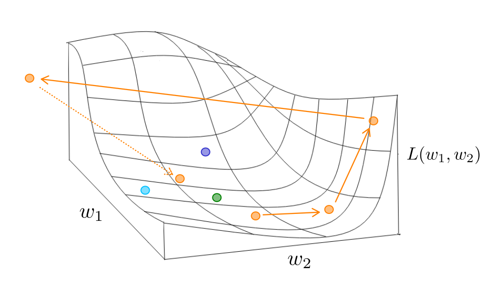
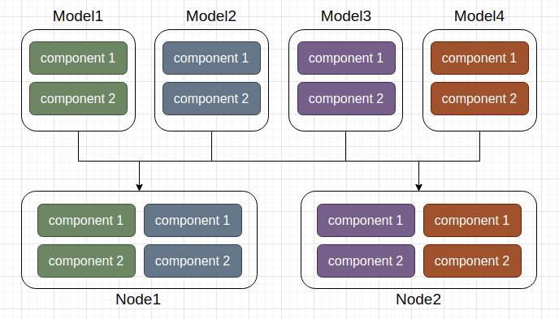
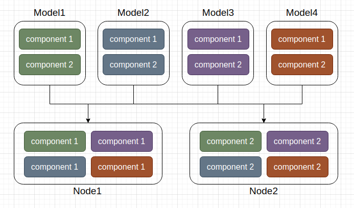
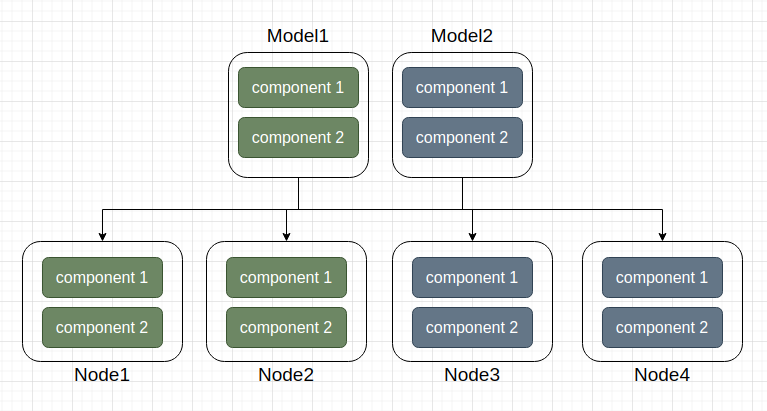

Why Nytorch?
==================

The primary goal of Nytorch is to provide a simple and efficient tool for researching and implementing algorithms that combine **Evolutionary Algorithm** and **Gradient Descent**.
The particle operation feature provided by Nytorch on top of PyTorch facilitates achieving this goal.

So, the remaining questions are:

	1. Why can particle operation be used to implement such a hybrid algorithm?
	2. Why is this hybrid algorithm worth researching and using?

Before diving in, let's briefly introduce Evolutionary Algorithm and particle operation.

Evolutionary Algorithm and Particle Operation
---------------------------------------------------

Evolutionary Algorithm is a general term for a class of algorithms, where the optimization process is typically carried out using particle operations. Here's a description of particle operation:

In optimization problems, we aim to find a set of parameters :math:`W`
that minimizes or maximizes the objective function. 
:math:`W` can be represented as a tuple of weights:

.. math:: W = (w_{1}, w_{2}, ... w_{n})

Now, suppose we have two sets of parameters :math:`W_{i}` and :math:`W_{j}` :

.. math::
	
   W_{i} = (w_{i1}, w_{i2}, ... w_{in})
   
   W_{j} = (w_{j1}, w_{j2}, ... w_{jn})
   
We can obtain new parameters :math:`W_{k}` and :math:`W_{l}` in two ways,
where :math:`\alpha` is a scalar :

.. math:: W_{k} = \alpha W_{i} = (\alpha w_{i1}, \alpha w_{i2}, ... \alpha w_{in})
	
.. math:: W_{l} = W_{i} + W_{j} = (w_{i1} + w_{j1}, w_{i2} + w_{j2}, ... w_{in} + w_{jn})

The parameters :math:`W` are referred to as **particle** ,
so these two methods of obtaining new particles are called **particle operation** ,
and a collection of particles is called a **swarm** .

With an understanding of particle operation, understanding evolutionary algorithms becomes easier. Like other machine learning algorithms, evolutionary algorithms train through multiple iterations. In each iteration, evolutionary algorithms obtain new particles through particle operations, ultimately converging to the final set of particles. Let's look at one type of Evolutionary Algorithm and see how it operates:

.. math::

	W_{i,t} = (1 - \beta) W_{i,t-1} + \beta W_{g,t-1} + \alpha W_{r}

This algorithm is called Accelerated Particle Swarm Optimization, where:

* :math:`W_{i,t}` is particle :math:`i` at time :math:`t` .
* :math:`W_{i,t-1}` is particle :math:`i` at time :math:`t-1` .
* :math:`W_{g,t-1}` is the best-known particle in the entire swarm at time :math:`t-1` .
* :math:`W_{r}` is a particle randomly sampled from a distribution, introducing some randomness into the update process.
* :math:`\alpha` and :math:`\beta`  are scalars.

In summary, the algorithm establishes a swarm and identifies the current best particle. In each iteration, it updates the swarm and the current best particle according to the formula, repeating iterations until a termination condition is met.

It's noteworthy that in evolutionary algorithms, optimization does not rely on gradients because it depends on global information. To obtain global information, a swarm needs to be maintained, and the optimization results often depend on the size of the swarm. In the example of Accelerated Particle Swarm Optimization, particle optimization depends on the global information :math:`W_{g,t-1}` ,meaning the optimization outcome is related to the size of the swarm. However, as the swarm size increases, so does the cost of maintaining the swarm.

It's important to mention that obtaining global information :math:`W_{g,t-1}` in this algorithm requires information from all particles in the swarm. However, in other evolutionary algorithms, obtaining global information may only require information from a subset of particles, resulting in varying costs of obtaining global information across different algorithms.

Shortcomings of the Single Algorithm
----------------------------------------

Let's discuss the advantages and disadvantages of Evolutionary Algorithm and Gradient Descent, as well as the motivation behind combining these two algorithms.

First, let's examine the Evolutionary Algorithm. Although the term "Evolutionary Algorithm" encompasses various algorithms, they share a common characteristic: they do not require any assumptions about the problem, making them widely applicable. Additionally, Evolutionary Algorithms utilize swarm-based parameter space search, which reduces the likelihood of getting stuck in local optima and enhances global search capabilities. However, there are clear drawbacks. Evolutionary Algorithms tend to optimize slower than Gradient Descent because they involve a larger computational overhead. The number of particles in a swarm is usually ten to a hundred, resulting in tenfold or hundredfold computational requirements compared to Gradient Descent. The larger the swarm size, the greater the computational demand and the stronger the global search capability, thus necessitating a balance between computational cost and search capability.

Now, let's consider Gradient Descent. Gradient Descent requires the target function to be differentiable, and its optimization process does not involve swarm-based parameter space search. It can train with just one particle, making it more efficient. Conversely, Gradient Descent lacks a global perspective, making it prone to getting trapped in local optima. Moreover, its optimization process is highly influenced by gradients, necessitating careful adjustment of the learning rate.

Both types of algorithms have their own set of issues. **For Evolutionary Algorithms, the primary problem lies in their high computational cost, which stems from the lack of gradient information.** Consequently, algorithms need to maintain a large swarm for parameter space search. This led to the development of Beetle Antennae Search, which obtains gradient-like information by considering two sets of parameters with opposite directions near the current parameter. **As for Gradient Descent, to avoid local optima, it requires a global perspective.** Momentum, for instance, aggregates gradients along the movement path to infer the optimization direction on a global scale.

Through this discussion, we can see that both types of algorithms attempt to address their respective issues by converging towards each other. This prompts the question: why not integrate them directly? Below, we list three benefits of combining Evolutionary Algorithms and Gradient Descent into a hybrid algorithm:

	1. Simultaneous consideration of global and gradient information.
	2. Improved training stability.
	3. Enhanced efficiency in distributed training.
	
To facilitate further discussion, we will temporarily refer to this hybrid algorithm as a "swarm algorithm."

Firstly, the swarm algorithm simultaneously considers global and gradient information, thus offering better exploration potential compared to algorithms that consider only one type of information.

Regarding stability improvement, we've all encountered situations where the loss suddenly spikes during model training. This instability occurs due to drastic changes in the loss curve within the parameter space, causing particles to diverge significantly from their original positions. In such cases, manual adjustments of gradient caps and learning rates are required. The swarm algorithm can automatically pull particles back towards nearby particles, thereby enhancing stability, especially with larger swarm sizes.

Lastly, concerning the efficiency of distributed training, we will discuss this further in the "Hardware Level" section.

How to Integrate at Different Levels?
----------------------------------------

Let's begin by summarizing the preceding content briefly. The essential difference between Evolutionary Algorithms and Gradient Descent lies in their optimization information sources: global information versus gradient information. We then enumerated three advantages of swarm algorithms, supporting their worthiness of research and utilization.

Now, we will discuss how to integrate Evolutionary Algorithm-style algorithms into existing Gradient Descent-based systems at various levels to establish swarm algorithms.

These three levels are:

	1. Algorithmic Level: Addressing optimization problems with differentiable parameters.
	2. Architectural Level: Addressing hyperparameter optimization problems.
	3. Hardware Level: Addressing optimization problems in distributed training.

Algorithmic Level
~~~~~~~~~~~~~~~~~~

At this level, we discuss optimization problems related to differentiable parameters. Under the premise of differentiability, both styles of algorithms can work together, allowing parameters to be updated considering both global and gradient information simultaneously. However, it's important to note that maintaining global information incurs a cost proportional to swarm size.
**Thus, a balance between information volume and maintenance cost is crucial.**

Two strategies can be applied:

	1. Adjusting swarm size.
	2. Adjusting the frequency of obtaining global information.
	
Let's first consider adjusting swarm size. We can reduce the swarm size to decrease maintenance costs, especially when gradient information is available. However, reducing the swarm size aggressively when gradient information is available can still ensure operability, even if there's only one particle in the swarm, essentially reverting to Gradient Descent. A smarter approach is to adjust swarm size based on the situation. When particles in the swarm are close in the parameter space, global information becomes less relevant, and thus, the swarm size can be reduced. Calculating the similarity between particles usually incurs significant computational costs, particularly with a large number of model parameters.
**Therefore, decreasing swarm size with increasing iteration counts is a reasonable approach.**

This approach is reasonable because multiple local solutions may exist in the parameter space, and the initial value greatly influences training outcomes. Choosing a better initial value corresponds to a better local solution. Traditionally, one would run training tasks multiple times, selecting the best-performing model for further training, which is inefficient. Using Evolutionary Algorithms to update the swarm before training can efficiently search for a better initial value. Therefore, a larger swarm size during the initial training phase benefits the search for a good initial value, while a smaller swarm size during later training focuses on faster convergence.

Another strategy involves adjusting the frequency of acquiring global information. This implies designing algorithms to update solely based on gradient information, making global information not imperative for every model update. By modulating the frequency of utilizing global information for model updates, communication costs can be managed.
The adjustment in acquiring global information aligns with the strategy of adjusting swarm size: **higher frequency during the initial training phase and lower frequency thereafter.**

Architectural Level
~~~~~~~~~~~~~~~~~~~~~~

The architectural level refers to the entire machine learning system, including the model, objective function, data, and algorithms. Optimization problems at this level are typically non-differentiable, which is the domain where evolutionary algorithms traditionally excel.

These problems include:

	1. Hyperparameter optimization problems.
	2. Optimization problems with non-differentiable objective functions.

The fusion approach for hyperparameter optimization problems usually involves training non-differentiable hyperparameters using evolutionary algorithms while training differentiable model parameters using gradient descent. These two parts of parameter training are staggered over time.

For optimization problems with non-differentiable objective functions, this typically arises when model parameters are differentiable, and there are multiple objective functions, some of which are differentiable, while others are not. This scenario is common in reinforcement learning, where labeled data may be insufficient to train the model, and additional data must be acquired through interaction with the environment, which is non-differentiable.

For both scenarios above, the coexistence of the two algorithmic styles is due to the presence of non-differentiable factors in the architecture. Research efforts are already addressing these non-differentiable problems, such as Neural Architecture Search for neural architecture problems and Proximal Policy Optimization for non-differentiable objective functions in reinforcement learning. Therefore, while swarm algorithms can solve most non-differentiable problems, it is necessary to consider whether to use swarm algorithms depending on the situation.

Hardware Level
~~~~~~~~~~~~~~~~~

At this level, we discuss the characteristics of swarm algorithms at the hardware level and explore possible strategies to improve efficiency. Here, we primarily focus on optimization scenarios for distributed training, although the concept of such optimization can be extended to any scenario involving parallel training.

For distributed training tasks, based on the size of the model being trained, we can categorize them into:
	
	1. Large Model Training Tasks
	2. Small Model Training Tasks
	
For large model training tasks, the primary objective of distributed training is to decompose a large model into smaller components that can operate independently and distribute them across various computing nodes. This is typically achieved through Pipeline Parallelism. On the other hand, for small model training tasks, the model is replicated into multiple copies and distributed across computing nodes, usually through data parallelism.

**For swarm algorithms, at the hardware level, they are closer to small model training tasks, where multiple copies of the model need to be distributed across computing nodes.** However, unlike traditional data parallelism training approaches, the models distributed to different computing nodes in swarm algorithms do not share the same set of parameters. Instead, each model has its own independent parameters, allowing them to operate autonomously.

This brings about two important features:

	1. Decentralization
	2. Asynchronous Training

Decentralization means that each computing node can independently complete its training tasks without relying on any other node to aggregate results. Asynchronous training means that the training tasks on each computing node can proceed independently of the computations on other nodes and can continue training while waiting for other nodes.

In contrast, in traditional data parallelism, each iteration must wait for all computing nodes to complete their computations and exchange results through communication. However, in swarm algorithms, not every iteration requires communication. **Each computing node can update parameters independently or exchange information for parameter updates,** and the process does not necessarily require waiting for all nodes to be ready.

Next, we discuss allocation strategies, which refer to how the model parameters in the swarm are allocated to various computing nodes.

There are two allocation strategies:

	1. Model Prioritization Policy
	2. Component Prioritization Policy

The first strategy, model prioritization policy, aims to allocate components of the same model to the same computing node whenever possible. This strategy allows each computing node to independently complete training tasks, offering the advantages of decentralization and asynchronous training. However, a drawback is that particle operations between computing nodes may involve transmitting model parameters, which typically require substantial communication overhead.

	
The second strategy, component prioritization policy, aims to allocate components of the same type to the same computing node whenever possible. In this strategy, computing nodes cannot independently complete training tasks, losing the asynchronous training feature. However, the advantage is that obtaining model parameters required for particle operations becomes easier, leading to reduced communication requirements. Additionally, the need to store intermediate variables, which is often a concern in large model training tasks, is alleviated in evolutionary algorithms, thus reducing memory usage or the cost of recalculating intermediate variables.
	

The choice between these two allocation strategies is not fixed and may change depending on the algorithm being used or the training phase.
**If particle operations require high efficiency, the component prioritization policy may be preferred. Conversely, if decentralization and asynchronous training are prioritized, the model prioritization policy may be favored.**
Swarm algorithms are not mutually exclusive with data parallelism; when resources exceed the swarm size, conditions suitable for data parallelism are met. Therefore, the choice of swarm size should consider both the nature of the algorithm and the resource conditions.

Conclusion
---------------

In the preceding discussion, we first understand what Evolutionary algorithms and particle operations are and introduce the motivation for integrating the two algorithms. Finally, we discuss how to integrate the two algorithms at various levels within the existing system, which has the potential to improve the current system. Specifically, improvements are seen in existing algorithms and distributed training patterns.
**For improving existing algorithms, the addition of global information helps avoid local optima and enhances training stability. For distributed training, the addition of decentralization and asynchronous training reduces waiting and communication time, thus improving efficiency.**

To prevent misunderstandings, it's essential to clarify that using swarm algorithms does not guarantee better training performance; rather, swarm algorithms offer more flexible choices at different levels. For example, adding global information at the algorithmic level may slow down training in some cases because global information may not be essential in certain situations. Similarly, although asynchronous training in swarm algorithms reduces waiting and communication time, it may sacrifice information exchange among computing nodes, leading to poorer training performance. Therefore, swarm algorithms are simply a new choice, and achieving optimal results requires balancing various factors.

Finally, from an overall perspective, research on integrating two algorithms not only needs to propose algorithms that integrate global information and gradient information but also requires corresponding resource allocation schemes. This may be the ultimate goal of research on integrating two algorithms.

That concludes this explanation. If you have any thoughts, feel free to send them to my email. Thank you for reading until the end!

